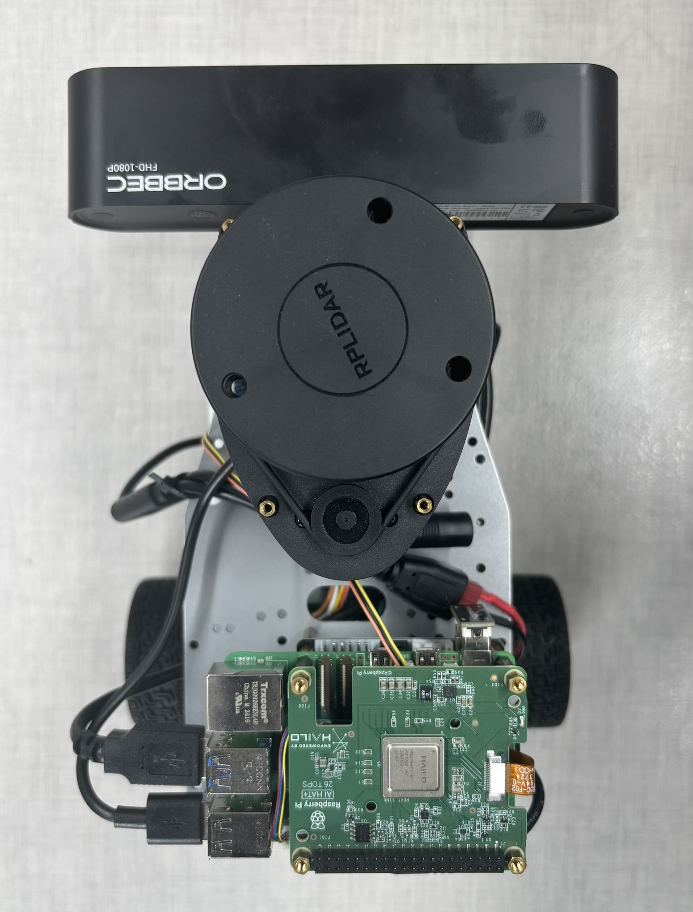

# ros2_skynet

基于 **树莓派5** 的 **ROS 2 智能小车项目**。

支持 **浏览器远程控制（FPV + WebRTC）**🚙💨、**手柄遥控** 🎮，并通过 micro-ROS 与底层控制版通信 🔌。

------

## 功能特性 ✨

- 🚙 **FPV 模式**：浏览器低延迟视频流（WebRTC）
- 🎮 **手柄遥控**：支持蓝牙 / 有线 XBOX 手柄
- 🔌 **micro-ROS 通信**：串口连接底层控制版，支持 cmd_vel / 蜂鸣器
- 🐳 **Docker 化运行**：ROS 2 容器快速部署
- 🎥 **摄像头预览**：支持 web_video_server，局域网内直连

------

## 硬件与外设 ⚙️

- 🍓 **树莓派 5**
- 🎥 **Astra Pro Plus** 深度摄像头（ROS 2 驱动：ros2_astra_camera）
- 📟 **底层控制板**（推荐 Raspberry Pi Pico 2 W，运行 micro-ROS）
- 🎮 **XBOX 手柄**（或兼容 XBOX 协议的手柄，支持蓝牙 / 有线连接）

> 底层控制板不限于 Pico 2 W，只要支持 **micro-ROS** 并能处理 cmd_vel + 蜂鸣器控制即可。

------

## 安装部署 🐳

1. **Docker 启动**

   ```bash
   git clone https://github.com/fleetime0/ros2_skynet.git
   cd ros2_skynet
   docker compose up -d
   ```

2. **创建外设别名**

   通过 **udev** 为设备创建别名，ros2_astra_camera需要。

   ```bash
   sudo cp -r scripts/* /etc/udev/rules.d/
   sudo udevadm control --reload-rules && sudo udevadm trigger
   ```

------

## 使用方法 🚀

所有命令需在容器内部执行：

```bash
docker exec -it ros2_skynet bash
```

### 浏览器远程控制小车 + 摄像头预览（低延迟 WebRTC FPV）

1. 启动摄像头 WebRTC 节点

   ```bash
   ros2 launch skynet_bringup skynet_cam.launch.py
   ```

   - **默认端口：8000**

2. 启动 micro-ROS Agent（串口通信）

   ```bash
   ros2 run micro_ros_agent micro_ros_agent serial -b 921600 --dev /dev/serial0
   ```

3. 启动 rosbridge websocket

   ```bash
   ros2 launch rosbridge_server rosbridge_websocket_launch.xml
   ```

   - **默认端口：9090**

4. 部署前端 [skynet-web](https://github.com/fleetime0/skynet-web) 后，浏览器即可实现 **FPV + 控制** 🌐🚙。

------

### 手柄控制小车（XBOX / 兼容）

1. 启动 micro-ROS Agent

   ```bash
   ros2 run micro_ros_agent micro_ros_agent serial -b 921600 --dev /dev/serial0
   ```

2. 蓝牙连接手柄

3. 启动手柄控制节点

   ```bash
   ros2 launch skynet_ctrl skynet_joy_launch.py
   ```

   - **LB**：开启控制

   - **左摇杆上下**：前进 / 后退

   - **右摇杆左右**：左转 / 右转

   - **方向键上**：鸣笛 🔊

------

### 摄像头浏览（web_video_server） 

如仅需简单视频流（非低延迟），可使用 web_video_server：

```bash
ros2 launch skynet_bringup web_cam.launch.py
```

浏览器访问：

```bash
http://<树莓派IP>:8080/stream?topic=/camera/color/image_raw&qos_profile=sensor_data
```

------

## 相关项目 📚

- [skynet_pico](https://github.com/fleetime0/skynet_pico) — 底层控制板（Pico 2 W + micro-ROS）
- [skynet-web](https://github.com/fleetime0/skynet-web) — 浏览器前端（FPV + 控制）

## 实物展示 🖼️

目前小车的实物照片如下：


